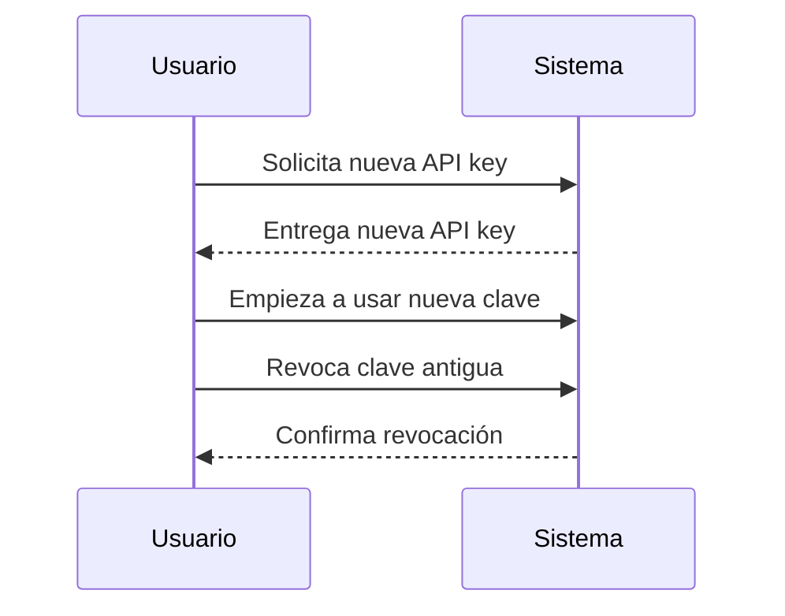
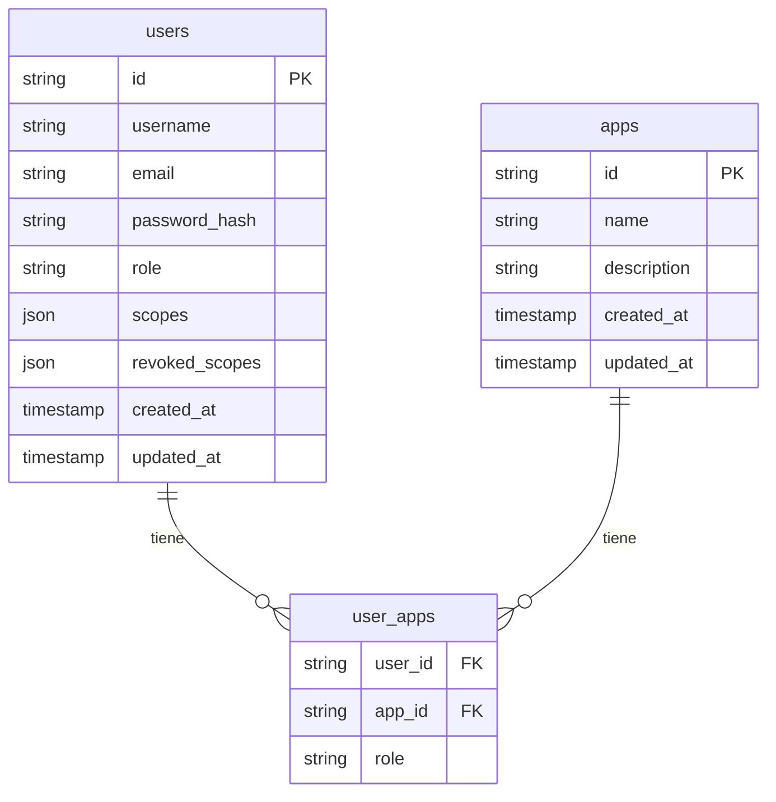
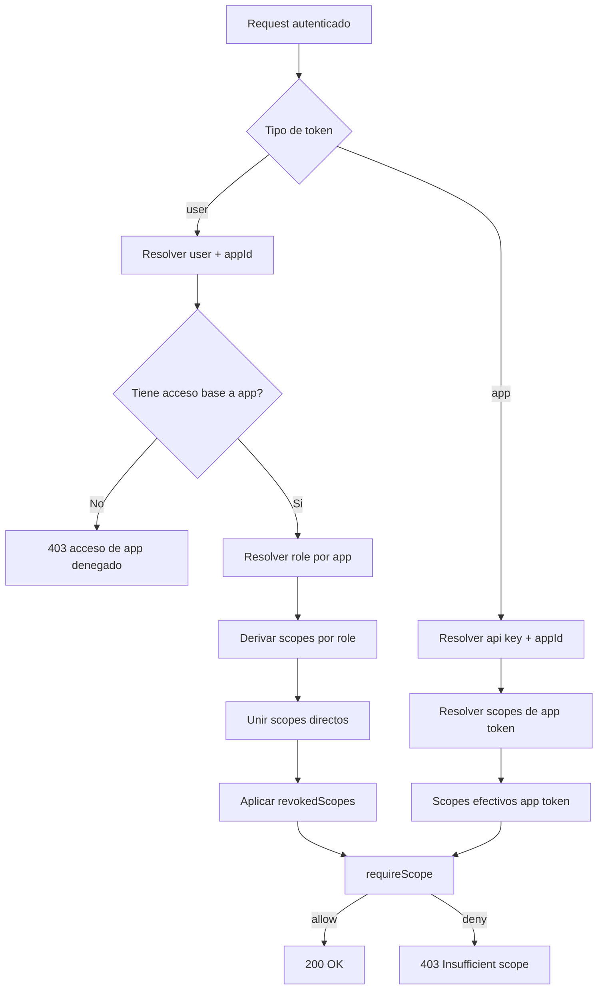
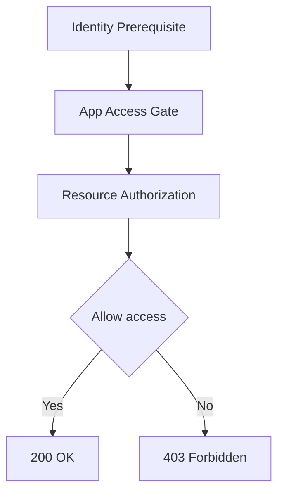

# Arquitectura General Inicial (2026-05-09)

## Gobernanza de documentación (para evitar desalineaciones)

### 1. Fuente de historial única
- Mantener una línea de tiempo central en [IMPLEMENTATION_TIMELINE.md](IMPLEMENTATION_TIMELINE.md).
- Toda decisión importante o cambio de arquitectura debe registrarse ahí con fecha y estado.

### 2. Estado explícito por documento
Al inicio de cada documento técnico, incluir:
- `Última actualización: YYYY-MM-DD`
- `Estado: active | superseded | deprecated`
- `Ámbito: actual | histórico`

### 3. Regla de modificación
- Si un documento cambia de propósito (por ejemplo, de actual a histórico), no se borra contexto:
   - Se marca como `superseded`.
   - Se agrega enlace al documento que lo reemplaza.

### 4. Regla para nuevos documentos
- Antes de crear un doc nuevo, verificar si ya existe uno equivalente en `_docs`.
- Si existe, actualizarlo.
- Si no existe, crearlo con metadata de estado/fecha.
## 1. Estructura de Repositorio (Monorepo)

```
myapps/
  backend/         # Core API, gestión de apps, usuarios, apikeys, SSO, etc.
  frontend/        # Dashboard de gestión, UI centralizada
  apps/
    catalog/
      backend/
      frontend/
    print3d/
      backend/
      frontend/
  _docs/           # Documentación viva del sistema
```

- **Panel central:** myapps.tudominio.com
- **Apps:** catalog.tudominio.com, print3d.tudominio.com, etc.

---

## 2. Gestión de Aplicaciones y API Keys (Pudo haber cambiado, esto se tomo de un documento previo)
- Cada app se registra con nombre, descripción, scopes/recursos, etc.
- Las API keys se generan a nivel de aplicación, no de usuario.
- Cada API key puede tener permisos/scopes específicos sobre recursos de la app.
- Las apps pueden tener usuarios internos (para acceso granular) o integrarse con el SSO central.

## 3. Gestión de Acceso y Seguridad(Pudo haber cambiado, esto se tomo de un documento previo)
- Autenticación y autorización básica centralizada en el core.
- El core emite tokens temporales (JWT) para las apps, firmados y validados por el core.
- Las apps validan los tokens y consultan al core para scopes/roles si es necesario.
- SSO: un solo login para todas las apps.
- El core gestiona sesiones, refresh tokens, y federación de identidad.

## 4. Convenciones y Nombres
- apps/catalog/backend, apps/catalog/frontend
- apps/print3d/backend, etc.
- El core puede llamarse backend y frontend en la raíz.

## 5. Tecnologías y Patrones Sugeridos
- **Backend:** Node.js (Express, NestJS), TypeScript recomendado.
- **Frontend:** React, Next.js, o similar.
- **Autenticación:** JWT, OAuth2, OpenID Connect (si quieres federar con otros sistemas).
- **Base de datos:** MySQL/PostgreSQL para el core, cada app puede tener su propia DB si lo requiere.
- **Infraestructura:** Docker, Docker Compose, o Kubernetes para despliegue y aislamiento.

> **Este documento es el mapa inicial. Actualiza o crea uno nuevo cada vez que cambie la arquitectura general.**


# Modularización y Reutilización de Sistemas

**Fecha de creación:** 2026-05-11
**Propósito:** Documentar la visión, patrón y estructura para la modularización y reutilización de sistemas en el monorepo myapps.

## Visión

Para maximizar la reutilización y el mantenimiento, los sistemas clave (gestión de usuarios, gestión de apps, etc.) se implementarán como módulos desacoplados en `packages/`, permitiendo su uso en cualquier backend del monorepo.

## Patrón propuesto

- **Lógica desacoplada:** La lógica de negocio (alta, baja, login, permisos, etc.) no depende de una base de datos específica.
- **Adaptadores de persistencia:** Cada módulo define interfaces para acceso a datos. Cada servicio implementa el adaptador según su modelo/tabla/DB.
- **Configuración inyectable:** Los módulos reciben la configuración (modelos, conexión, etc.) al inicializarse.
- **Ejemplo de estructura:**

```
myapps/
  packages/
    user-management/
      src/
        index.ts
        controllers/
        services/
        adapters/
      README.md
      package.json
    app-management/
      ...
```

## Ejemplo de uso

```js
// En apps/catalog/backend
const userManagement = require('user-management');
userManagement.init({ userModel: CatalogUserModel });
```

## Beneficios
- Reutilización máxima de lógica de negocio
- Menor duplicidad de código
- Fácil mantenimiento y evolución
- Adaptable a cualquier app o dominio

## Siguientes pasos (Esto probablemente ya se realizó)
1. Crear la estructura base en `packages/`.
2. Implementar el primer módulo (`user-management`) con interfaces y ejemplo de adaptador.
3. Documentar el patrón y ejemplos en cada módulo.

---


# Decisiones de diseño — Esquema de base de datos

> El DDL y seed están en `backend/migrations/`. Este archivo explica el **por qué** de las decisiones de diseño.

## Convenciones generales
- IDs: `VARCHAR(32)` generado con `crypto.randomUUID()` truncado — no `AUTO_INCREMENT`.
  Razón: portabilidad entre ambientes sin coordinación de secuencias.
- Nombres de tablas y columnas: `snake_case` en DB → mapeados a `camelCase` en JS por las funciones `mapXxxRow()` en `src/models/`.
- JSON columns (`scopes`, `revoked_scopes`): MySQL devuelve estos como strings en algunas configuraciones; siempre pasar por `parseJsonArray()` al leer.

## bcrypt vs JWT (frecuentemente confundidos)

| | bcrypt | JWT |
|---|---|---|
| Propósito | Hashear contraseñas | Firmar/verificar tokens |
| Secret global | No necesita ninguno | Usa `JWT_SECRET` del `.env` |
| Salt | Generado automáticamente, embebido en el hash | N/A |
| Verificación | `bcrypt.compare(plain, hash)` | `jwt.verify(token, JWT_SECRET)` |

No existe relación entre `JWT_SECRET` y el hash de contraseñas. Son mecanismos independientes.
# Auditoría de eventos y rotación de API keys

## Auditoría de eventos

La auditoría de eventos consiste en registrar de forma detallada todas las acciones relevantes que ocurren en el sistema, especialmente aquellas relacionadas con la seguridad o cambios críticos. En el contexto de API keys, esto implica guardar un historial de:

- Quién creó, usó, revocó o intentó usar una API key.
- Cuándo ocurrió cada acción (timestamp).
- Desde qué IP, usuario, app, o contexto se realizó la acción.
- Resultado de la acción (éxito, error, motivo de revocación, etc.).

**¿Para qué sirve?**
- Permite rastrear incidentes de seguridad.
- Facilita el cumplimiento de normativas (compliance).
- Ayuda a depurar problemas y detectar usos indebidos.

**Ejemplo de evento auditado:**
```json
{
  "event": "API_KEY_REVOKED",
  "apiKey": "abc123",
  "revokedBy": "admin@empresa.com",
  "timestamp": "2026-05-28T12:34:56Z",
  "reason": "compromiso detectado",
  "ip": "192.168.1.10"
}
```

---
# Separación futura de la app Catalog

## Objetivo
Dejar preparada la app Catalog para poder aislarla y comercializarla como producto independiente en el futuro, sin necesidad de modificar el código actual.

## Buenas prácticas implementadas
- **Modularidad:** Toda la lógica de Catalog está en su propio módulo, desacoplada del backend central.
- **Routers exportables:** Catalog expone routers Express que pueden ser montados en cualquier backend.
- **Configuración por entorno:** Uso de variables de entorno y archivos `.env` para facilitar despliegue independiente.
- **API Key única:** Se recomienda generar y documentar un apiKey aleatorio para cada despliegue/instancia.
- **Sin dependencias cruzadas:** Catalog no depende de rutas ni lógica del backend central.
- **Documentación:** Endpoints, flujos de autenticación y uso de apiKey están documentados.

## Recomendaciones para facilitar la separación
1. **Mantener interfaces claras** entre módulos y servicios.
2. **No acoplar lógica de negocio** de Catalog al backend central.
3. **Scripts de build y start independientes** para Catalog.
4. **Documentar el apiKey** generado y su uso en pruebas/despliegues.
5. **Permitir configuración flexible** de puertos, rutas y variables de entorno.
6. **Pruebas y CI/CD independientes** para Catalog.

## Proceso sugerido para separación futura
1. Copiar el directorio `apps/catalog/backend-ts` a un nuevo repositorio.
2. Generar un nuevo apiKey seguro y configurarlo en `.env`.
3. Montar el router principal de Catalog en un servidor Express propio.
4. Actualizar la documentación y endpoints según el nuevo contexto.
5. Probar todos los flujos de autenticación y autorización.

## Nota
Actualmente, no es necesario realizar ninguna separación. Estas recomendaciones y estructura permiten que, si en el futuro se requiere, el proceso sea rápido, seguro y sin fricción.

## Rotación de claves (API key rotation)

La rotación de claves es el proceso de reemplazar periódicamente una API key por una nueva, sin interrumpir el servicio. Es una buena práctica de seguridad porque:

- Reduce el riesgo si una clave se ve comprometida.
- Permite actualizar permisos o cambiar de entorno sin dejar claves antiguas activas.

**¿Cómo funciona?**
1. El sistema permite generar una nueva API key antes de eliminar la anterior.
2. Ambas claves pueden funcionar durante un periodo de transición.
3. Se revoca la clave antigua cuando la nueva ya está en uso.

**Ejemplo de flujo de rotación:**
1. Usuario solicita una nueva API key.
2. El sistema crea la nueva y la asocia al usuario/app.
3. El usuario actualiza sus sistemas para usar la nueva clave.
4. El usuario o el sistema revoca la clave anterior.



---

## Consideraciones para apps con múltiples API keys

Si una aplicación puede tener múltiples API keys (por ejemplo, para distintos desarrolladores o propósitos), la rotación tradicional pierde sentido, ya que cada desarrollador puede gestionar su propia clave de forma independiente. En este caso:

- Es válido permitir varias API keys activas por app.
- La revocación y auditoría siguen siendo fundamentales para seguridad y trazabilidad.
- La "rotación" se convierte en un proceso de revocación y creación de nuevas claves según necesidad, no necesariamente en un ciclo periódico.

---

**Recomendación:**
- Implementar auditoría de eventos es esencial para seguridad y cumplimiento.
- Permitir múltiples API keys por app es una práctica moderna y flexible.
- La rotación tradicional es menos relevante, pero la revocación y la gestión granular de claves son clave.

---

_Actualizado: 2026-05-28_

## Scopes y roles

Los scopes del JWT **no se guardan** directamente en `users.scopes` para la sesión — se derivan en runtime:
1. Login → `getUserAppRoles(userId)` consulta `user_apps`
2. `deriveScopes(user, rolesPorApp, appIds)` aplica el mapa `ROLE_SCOPES` de `authRoutes.ts`
3. El resultado se firma en el JWT

`users.scopes` funciona como override manual (admin puede forzar scopes custom).
`users.revoked_scopes` permite revocar scopes individuales sin cambiar el rol.

## Orden de ejecución en DBeaver

```
1. 20260529_create_users_table.sql
2. 20260529_create_user_apps_table.sql
3. 20260601_create_apps_api_keys.sql
4. 20260601_seed_dev.sql          ← idempotente, re-ejecutable
```


# Modelo/Diseño de Autenticacion/Autorizacion
Ultima actualizacion: 2026-06-23
Estado: active
Ambito: actual


## Objetivo
Definir un modelo de autorizacion claro y robusto para el backend actual, separando de forma explicita:

1. Acceso de ingreso a una app (quien puede entrar)
2. Acceso granular a recursos (que puede hacer dentro)

Este modelo mantiene terminologia existente (`role`, `scopes`, `user_apps`, `api keys`) y agrega solo conceptos minimos para mejorar entendimiento.

---
## Principios
- El backend central soporta múltiples aplicaciones (apps) y usuarios.
- Los endpoints de autenticación distinguen el contexto de aplicación mediante un parámetro `appId` (o similar).
- Si no se especifica `appId`, se asume la app por defecto (`default`).
- El JWT emitido siempre incluye el `appId`.
- Los endpoints protegidos validan el token y extraen el contexto de app.

## Endpoints

### POST /api/auth/login
- Autentica/valida usuario en el contexto de una app (username/email + password?).
- Body:
  ```json
  {
    "username": "...",
    "password": "...",
    "appId": "catalog" // opcional, default si no se envía
  }
  ```
- Responde con JWT tipo user que incluye `appId`.

### POST /api/auth/token
- Autentica/valida una app vía apiKey.
- Body:
  ```json
  {
    "apiKey": "..."
  }
  ```
- El backend busca la app correspondiente y emite JWT tipo app con `appId`.

## Notas
- El backend central expone rutas planas: `/api/users`, `/api/apps`, `/api/auth`.
- El middleware de autorización extrae el contexto de app del JWT.
- Si se autentica sin `appId`, se asume la app por defecto.
- El campo de usuario para login es `username` (no `email`).

## Principio central

La autorizacion se decide en dos capas:

- Capa A: Acceso a app. Solo responde identidad (si el token/cadena de autenticacion es valida)
  - Respuesta: "puede entrar a esta app?"quien es el sujeto (usuario o app)?
  - Fuente principal: `user_apps` (para usuarios) y `api_keys` (para apps)
  - No responde permisos de recursos.

- Capa B: Acceso a recurso
  - Respuesta: "que accion puede ejecutar dentro de la app?"
  - Fuente principal: scopes efectivos (`role` derivado + scopes directos - revokedScopes)

---

## Vocabulario del modelo

- Identidad: sujeto autenticado (usuario o app)
- Contexto de app: `appId` contra el que se evalua acceso
- Acceso base: permiso de ingreso a una app
- Rol global de usuario: perfil transversal no atado a una app especifica
- Perfil de app: `role` del usuario en una app (`user`, `editor`, `admin`)
- Permiso granular: scope formato `<appId>:<action>:<resource>`
- Permiso efectivo: resultado final aplicado por middleware de scopes

---
# Relación entre usuarios, apps y roles en el backend

## Diagrama entidad-relación (ER)



## ¿Dónde se registran los scopes?
- Los **scopes** (permisos granulares) se almacenan en el campo `scopes` de la tabla `users` como un array JSON.
- Los **scopes derivados** de roles se definen en el backend, por ejemplo:

```typescript
export const ROLE_SCOPES: Record<string, string[]> = {
    'admin': ['*'],
    'user': ['read:users', 'read:catalogs'],
    'editor': ['read:users', 'write:catalogs'],
};
```
- Cuando un usuario tiene un rol en una app (en `user_apps`), el backend calcula sus scopes efectivos combinando:
  - Scopes derivados del rol (`ROLE_SCOPES`)
  - Scopes directos (`users.scopes`)
  - Scopes revocados (`users.revoked_scopes`)

## Ejemplo de scopes en la base de datos
```json
["app1:read:users", "app1:write:catalogs"]
```

## Resumen
- La relación usuario-app-rol se modela con la tabla `user_apps`.
- Los scopes se derivan de los roles definidos en el backend y se pueden extender con scopes directos en la tabla `users`.
- Los scopes no se almacenan en una tabla separada, sino como JSON en el usuario y se calculan dinámicamente.

---

### ¿Qué significa “semántico” aquí?

Semántico = según el significado real de la operación, no solo por el verbo HTTP.

Ejemplo rápido:
- `POST /api/auth/login` usa POST, pero su significado real es validar credenciales y emitir token.
- Eso no modifica registros de negocio (usuarios/apps), por eso se trata como lectura semántica.

En cambio:
- `POST /api/users`
- `PATCH /api/users/:id`
- `POST /api/apps/:id/api-keys`

Sí cambian estado persistente, por tanto son escrituras semánticas y nunca deben hacer fallback automático a memoria.

### Buenas prácticas aplicadas
- Request-scoped runtime context (no global estático).
- Fallback solo en lecturas.
- Bloqueo explícito de escrituras cuando el primario no está disponible.
- Política configurable por `.env` (sin cambiar código para ajustes operativos).
- Endpoint de observabilidad: `/api/runtime/status`.


---


## Runtime dinámico por request Estado al 2026-06-01


- MySQL completamente integrado: users, apps, api_keys, user_apps
- `appController.ts` y `userController.ts` ya no usan `application-management` (in-memory)
- Nuevos archivos: `backend/src/models/app.ts`, `backend/src/services/appService.ts`
- Migrations documentadas con comentarios en `backend/migrations/`
- Seed de dev en `backend/migrations/20260601_seed_dev.sql` (idempotente)
- `_docs/backend-db-schema-inicial.md` reducido a decisiones de diseño (sin SQL duplicado)

### DataSourceProvider (plug & play)
El objetivo es poder cambiar de `mysql` a `memory` (o cualquier otro backend) con una sola variable de entorno `DATA_SOURCE=mysql|memory`, sin tocar lógica de negocio ni controladores.

**Plan de implementación:**

1. Definir interfaces en `backend/src/repositories/`:
   ```
   IUserRepository.ts   — listUsers, getUserById, createUser, updateUserScopes…
   IAppRepository.ts    — listApps, getAppById, createApp, addApiKey, revokeApiKey…
   ```

2. Crear implementaciones:
   ```
   backend/src/repositories/mysql/MysqlUserRepository.ts   ← mueve lógica de models/user.ts
   backend/src/repositories/mysql/MysqlAppRepository.ts    ← mueve lógica de models/app.ts
   backend/src/repositories/memory/MemoryUserRepository.ts
   backend/src/repositories/memory/MemoryAppRepository.ts
   ```

3. Crear el provider central en `backend/src/repositories/index.ts`:
   ```ts
   const source = process.env.DATA_SOURCE || 'mysql';
   export const userRepo: IUserRepository = source === 'mysql' ? new MysqlUserRepository() : new MemoryUserRepository();
   export const appRepo: IAppRepository  = source === 'mysql' ? new MysqlAppRepository()  : new MemoryAppRepository();
   ```

4. Los servicios (`userService.ts`, `appService.ts`) importan del provider, nunca de la implementación concreta.

5. Agregar `DATA_SOURCE=mysql` al `.env` y documentar en `sample.env`.

> Con esto, cambiar de MySQL a memoria (para tests, demos, o desarrollo offline) es solo cambiar `DATA_SOURCE=memory` — sin modificar nada más.

---

## Runtime dinámico por request (actualizado 2026-06-17)

### Qué problema resuelve
- Permite cambiar ambiente y fuente de datos sin reiniciar backend.
- Hace visible para el usuario qué pidió y qué fuente terminó respondiendo.
- Evita inconsistencias: no se permite fallback automático en escrituras reales.

### Cómo funciona (simple)
1. El frontend envía en cada request:
   - `x-runtime-env` (por ejemplo `dev` o `prod`)
   - `x-data-source` (por ejemplo `mysql` o `memory`)
2. El backend resuelve el contexto runtime por request.
3. Si MySQL está caído:
   - Lecturas: puede caer a `memory` (si la política lo permite).
   - Escrituras: se bloquean con `503` para no perder consistencia.
4. El backend devuelve headers de trazabilidad:
   - `x-runtime-env-requested`, `x-runtime-env-served`
   - `x-data-source-requested`, `x-data-source-served`
   - `x-data-source-fallback`, `x-data-source-mysql-available`

### Variables de entorno importantes
- `RUNTIME_ENV=dev`
- `ALLOWED_RUNTIME_ENVS=dev,prod`
- `ALLOWED_DATA_SOURCES=mysql,memory`
- `FALLBACK_READ_TO_MEMORY=true`
- `READ_SEMANTIC_POST_ROUTES=/api/auth/login,/api/auth/token`
- `MYSQL_HEALTH_TTL_MS=5000`
- `MYSQL_HEALTH_TIMEOUT_MS=350`
# GET /api/runtime/status
Ultima actualizacion: 2026-06-24
Estado: active
Ambito: actual

## Proposito

Endpoint de observabilidad del runtime por request.
Expone contexto efectivo, politicas activas y estado del health check de MySQL.

## Request

```http
GET /api/runtime/status
```

Headers opcionales:
- `x-runtime-env`
- `x-data-source`

## Response (resumen)

```json
{
	"status": "ok",
	"current": {
		"requestedEnvironment": "dev",
		"servedEnvironment": "dev",
		"requestedDataSource": "mysql",
		"servedDataSource": "mysql",
		"fallbackApplied": false,
		"mysqlAvailable": true,
		"operation": "read",
		"reason": null
	},
	"runtimeContext": {
		"dynamic": true,
		"note": null
	},
	"defaults": {
		"environment": "dev",
		"dataSource": "mysql"
	},
	"available": {
		"environments": ["dev", "prod"],
		"dataSources": ["mysql", "memory"]
	},
	"policy": {
		"fallbackReadToMemory": true,
		"readSemanticPostRoutes": ["/api/auth/login", "/api/auth/token"]
	},
	"mysqlHealthCache": {
		"cachedValue": true,
		"timeSinceLastCheck": "1.8s",
		"remaining": "13.2s",
		"ttl": "15.0s",
		"timeout": "3.0s",
		"dbLatency": "836ms",
		"lastCheckTimedOut": false
	}
}
```

## Campos clave

- `current.reason`:
	- `null`: flujo normal
	- `mysql_unavailable_read_fallback_memory`: MySQL no disponible, read con fallback
	- `mysql_unavailable_write_blocked`: write bloqueado por no disponibilidad de MySQL
	- `runtime_context_default_no_health_check`: contexto default (sin middleware)

- `mysqlHealthCache.dbLatency`:
	Tiempo real del ultimo probe de MySQL. Es el indicador mas util para decidir si `MYSQL_HEALTH_TIMEOUT_MS` esta demasiado ajustado.

- `mysqlHealthCache.lastCheckTimedOut`:
	`true` cuando el ultimo probe alcanzó timeout.


# Backend MySQL Connection Flow

## ¿Dónde y cómo se inicializa la conexión a la base de datos?

La conexión a MySQL se inicializa automáticamente la **primera vez que se importa** el archivo `backend/src/db.ts` en cualquier parte del backend. No es necesario importarlo manualmente en `index.ts`.

## Flujo de inicialización

```mermaid
graph TD
    A[Express server inicia (index.ts)] --> B[Se recibe una petición HTTP]
    B --> C[Se ejecuta un controlador (por ejemplo, userController.ts)]
    C --> D[El controlador importa userService.ts]
    D --> E[userService.ts importa user.ts (modelo)]
    E --> F[user.ts importa pool desde db.ts]
    F --> G[db.ts ejecuta mysql.createPool y exporta pool]
    G --> H[pool se usa para queries SQL]
```

## Ejemplo de importación en el modelo

```typescript
// backend/src/models/user.ts
import pool from '../db';

export async function getUserById(id: string) {
  const [rows] = await pool.execute('SELECT * FROM users WHERE id = ?', [id]);
  return rows[0] || null;
}
```

## Resumen
- La conexión se crea automáticamente al importar `db.ts`.
- El primer endpoint que use un modelo que importe `db.ts` inicializa el pool.
- No es necesario importar `db.ts` en `index.ts`.
- El pool se reutiliza en todo el backend.

---
**Ubicación de la lógica de conexión:**
- Archivo: `backend/src/db.ts`
- Usado por: Todos los modelos que interactúan con la base de datos.

---
> **Nota:** Si quieres forzar la conexión al arrancar el backend, puedes importar y hacer un `await pool.getConnection()` en `index.ts`, pero no es obligatorio ni común en aplicaciones Express.

## Queries útiles en DBeaver

### 1) Ver scopes directos y revocados de un usuario
```sql
SELECT
    id,
    username,
    role,
    scopes,
    revoked_scopes
FROM users
WHERE username = 'jorge';
```

### 2) Ver roles por app del usuario
```sql
SELECT
    ua.user_id,
    u.username,
    ua.app_id,
    a.name AS app_name,
    ua.role
FROM user_apps ua
JOIN users u ON u.id = ua.user_id
JOIN apps a ON a.id = ua.app_id
WHERE u.username = 'jorge';
```

### 3) Verificación rápida de acceso por app
```sql
SELECT
    u.username,
    ua.app_id,
    ua.role,
    u.scopes,
    u.revoked_scopes
FROM users u
LEFT JOIN user_apps ua ON ua.user_id = u.id
WHERE u.username = 'jorge';
```
# Test Users & Login
| Usuario | Password | Rol | appId requerido |
|---|---|---|---|
| jorge | jorge123 | admin | No |
| editor | editor123 | editor | Si (`app1`) |
| user | user123 | user | Si (`app1`) |

| App ID | Nombre |
|---|---|
| app1 | Catalogos |
| app2 | Notificaciones |

---

## Admin User

- **Username:** jorge
- **Password:** jorge123
- **Role:** admin (global)
- **Scopes:** ["*"]
- **appIds:** ["*"]
- **rolesPorApp:** { "*": "admin" }
- **Login body:**
  ```json
  {
    "username": "jorge",
    "password": "jorge123"
  }
  ```

## Test User


- **Username:** test
- **Password:** test123
- **Role:** user (scoped)
- **Scopes:** ["ratw3urj:read:users", "ratw3urj:read:catalogs"]
- **appIds:** (none by default)
- **rolesPorApp:** (none by default)
- **Login body:**
  ```json
  {
    "username": "test",
    "password": "test123",
    "appId": "ratw3urj"
  }
  ```

## Notas
- El usuario admin puede loguearse sin appId.
- El usuario test requiere appId válido para login.
- Ambos usuarios están inicializados automáticamente en memoria al arrancar el backend.

## Tutorial breve: dar acceso de app a un usuario existente

Caso típico: el login de `editor` devuelve `403 User does not have access to this app`.

Esto ocurre porque `POST /api/auth/login` valida acceso en `user_apps`.

### 1) Obtener token admin

```json
POST /api/auth/login
{
  "username": "jorge",
  "password": "jorge123"
}
```

### 2) Buscar `userId` del usuario objetivo

```http
GET /api/users?limit=100&offset=0
Authorization: Bearer <ADMIN_TOKEN>
```

En la respuesta, toma el `id` del usuario `editor`.

### 3) Asignar acceso de app por endpoint

```json
POST /api/users/:userId/apps
Authorization: Bearer <ADMIN_TOKEN>
{
  "appId": "795145432d094d5f",
  "role": "editor"
}
```

`role` es opcional. Si no lo mandas, se asume `user`.

Roles válidos actuales: `admin`, `editor`, `user`.

### 4) Probar login con appId

```json
{
  "username": "editor",
  "password": "editor123",
  "appId": "795145432d094d5f"
}
```

Resultado esperado: `200` con `token`.

## Aclaración importante: scopes vs acceso a app

- `POST /api/users/:userId/scopes` **sí existe**, pero solo agrega scopes directos (`users.scopes`).
- El login con `appId` valida pertenencia en `user_apps` (app-role mapping).
- `user_apps` responde a: “¿puede entrar a esta app?”
- `role` dentro de `user_apps` responde a: “¿qué perfil tendrá dentro de esa app?”
- Por lo tanto, agregar scopes directos **no sustituye** asignar `user_apps`.
- Si solo quieres habilitar acceso y no te importa el perfil aún, omite `role` y quedará `user` por defecto.

En resumen:
- Para permisos finos: `POST /api/users/:userId/scopes`
- Para permitir login con una app específica: `POST /api/users/:userId/apps`

# Tests automatizados de auth/authz
Ultima actualizacion: 2026-06-24
Estado: active
Ambito: actual

## Objetivo
Explicar que pruebas automatizadas existen hoy en backend para authentication/authorization,
como ejecutarlas y cual es su impacto real en MySQL.

## Resumen corto
- Tipo actual: unit tests (logica pura + middleware con mocks).
- Runner: Node test runner (`node:test`).
- Comando general: `npm run test`.
- Comando focalizado authz: `npm run test:authz`.
- Impacto en BD MySQL: ninguno.

## Donde viven
- `backend/src/tests/authorizationService.test.ts`
- `backend/src/tests/requireAppAccess.test.ts`

## Que cubre cada archivo

### 1) authorizationService.test.ts
Valida reglas del modelo de autorizacion central:
- mapeo base de `ROLE_SCOPES`
- derivacion de scopes efectivos
- mezcla de scopes por rol + scopes directos
- aplicacion de `revokedScopes`
- decision de acceso por app para user/admin
- matching de scopes con wildcards
- saneamiento de payload de scopes

### 2) requireAppAccess.test.ts
Valida el middleware de acceso por app:
- permite admin global
- permite usuario con app autorizada
- bloquea usuario sin acceso a app objetivo (403)
- valida `appId` requerido (400)

## Como ejecutar
Desde `backend/`:

1. Suite completa de tests existentes:

```bash
npm run test
```

2. Solo suite authz:

```bash
npm run test:authz
```

## Los tests tocan MySQL?
No.

Motivo tecnico:
- No levantan servidor Express.
- No importan `db.ts` ni repositorios MySQL.
- No ejecutan queries SQL.
- Usan objetos mockados en memoria para `req/res` y entidades de prueba.

En la practica:
- No insertan, actualizan ni borran datos en MySQL.
- Son seguras para correr localmente cuantas veces quieras.

## Limites actuales (importante)
Estos tests no reemplazan pruebas funcionales con endpoints reales.

Aun faltan (si queremos cobertura completa):
- tests de integracion HTTP contra rutas protegidas
- validacion end-to-end con JWT real
- validacion en datasource MySQL real (entorno controlado)

## Recomendacion operativa
Usar este orden:
1. `npm run test` (regresion rapida de reglas auth/authz)
2. Pruebas en Insomnia (flujo real de endpoints)
3. Cuando exista entorno dedicado, agregar integracion con MySQL aislada
---

## Fuentes de verdad actuales

### Usuario

- Tabla `users`:
  - `role` (rol global de usuario; hoy se usa de forma limitada, especialmente para admin)
  - `scopes` (permisos directos)
  - `revokedScopes` (denegaciones explicitas)

- Tabla `user_apps` (user_id, app_id, role):
  - `user_id`
  - `app_id`
  - `role` (perfil del usuario dentro de la app)

- Regla:
Si no existe relacion user-app, login con appId devuelve 403.
  

### Aplicacion (maquina a maquina)

- Tabla/flujo de `api_keys`:
  - api key asociada a app
  - scopes de api key (cuando aplica)

  Regla:
- Si la api key no existe/no esta activa/no corresponde, no hay token valido.
- Para usuarios: se valida relacion en user_apps.
- Para app tokens: se valida api key activa y asociacion correcta.
- Sin acceso base a app, no hay ingreso aunque existan scopes directos.

## Nota importante

Role en user_apps no solo es metadata:
- define perfil minimo dentro de la app
- habilita derivacion de scopes por role

## Endpoint operativo

- POST /api/users/:userId/apps
  - body: { appId, role? }
  - role default: user

- DELETE /api/users/:userId/apps/:appId
  - remueve acceso de app


---
## Definiciones

- **Scopes derivados:**
  - Permisos generados automáticamente a partir de los roles asignados al usuario usando el mapeo `ROLE_SCOPES`.
  - Ejemplo: Si el usuario tiene rol `editor` en la app `ratw3urj`, los scopes derivados serán `ratw3urj:read:users` y `ratw3urj:write:catalogs`.

- **Scopes directos:**
  - Permisos agregados o quitados explícitamente al usuario en el campo `scopes`.
  - Se usan para excepciones o permisos especiales que no provienen del rol.
  - Ejemplo: Si a `editor` se le agrega `ratw3urj:delete:catalogs` en `scopes`, ese permiso es directo.

- **Scopes efectivos:**
  - Es la combinación de ambos: scopes derivados del rol + scopes directos asignados al usuario (sin duplicados).
  - Es lo que realmente valida el backend para acceso.


## Convención de IDs de usuario

- Todos los usuarios (incluidos los iniciales) usan IDs únicos generados automáticamente.
- Los IDs numéricos quedan obsoletos.
- **En desarrollo/local:** Se usa una función simpleId() para generar IDs cortos y únicos (no criptográficos).
- **IMPORTANTE:** Para producción, migrar a una solución robusta como [nanoid](https://github.com/ai/nanoid) para asegurar unicidad global y seguridad criptográfica.
- Los usuarios iniciales pueden usar valores fijos tipo NanoID para facilitar pruebas y documentación.

> ⚠️ **Advertencia:** La función simpleId() es solo para ambientes de desarrollo/local/testing. No garantiza unicidad global ni seguridad criptográfica. ¡Migrar a nanoid antes de producción!

## Ejemplo de respuesta del endpoint `/api/users/:userId/scopes`

```json
{
  "userId": "3",
  "scopesDerivados": [
    "ratw3urj:read:users",
    "ratw3urj:write:catalogs"
  ],
  "scopesDirectos": [
    "ratw3urj:delete:catalogs"
  ],
  "scopesEfectivos": [
    "ratw3urj:read:users",
    "ratw3urj:write:catalogs",
    "ratw3urj:delete:catalogs"
  ]
}
```

## Buenas prácticas
- El campo `scopes` del usuario debe usarse solo para excepciones.
- Si el usuario solo debe tener los permisos de su rol, deja `scopes: []` o no lo incluyas.
- El endpoint de scopes permite auditar y distinguir el origen de cada permiso.

## Endpoints para gestión dinámica de scopes y revokedScopes

### Autenticación

1. **POST `/auth/login`**
   - Body (JSON):
     ```json
     { "username": "<usuario>", "password": "<contraseña>" }
     ```
   - Respuesta: JWT para usar en los siguientes endpoints.

### Consultar scopes de un usuario

2. **GET `/users/:userId/scopes`**
   - Headers:
     - Authorization: Bearer <JWT>
   - Respuesta: Scopes derivados, directos, revocados y efectivos.

### Agregar un scope directo

3. **POST `/users/:userId/scopes`**
   - Headers:
     - Authorization: Bearer <JWT>
   - Body (JSON):
     ```json
     { "scope": "<appId>:<action>:<resource>" }
     ```
   - Valida formato y existencia del scope.

### Remover un scope directo

4. **DELETE `/users/:userId/scopes`**
   - Headers:
     - Authorization: Bearer <JWT>
   - Body (JSON):
     ```json
     { "scope": "<appId>:<action>:<resource>" }
     ```

### Revocar un scope (revokedScopes)

5. **POST `/users/:userId/revoked-scopes`**
   - Headers:
     - Authorization: Bearer <JWT>
   - Body (JSON):
     ```json
     { "scope": "<appId>:<action>:<resource>" }
     ```
   - El scope será excluido de los efectivos aunque lo tenga por rol o directo.

### Restaurar un scope revocado

6. **DELETE `/users/:userId/revoked-scopes`**
   - Headers:
     - Authorization: Bearer <JWT>
   - Body (JSON):
     ```json
     { "scope": "<appId>:<action>:<resource>" }
     ```

> Todos los endpoints requieren JWT válido y validan el formato y existencia del scope.

---
**Revocación global de API keys (recomendado):**

- DELETE `/api/apps/apikeys/:apiKey`
  - Revoca la API key en cualquier app donde exista.
  - Uso estándar y robusto para la mayoría de los casos.

**Revocación por app específica (casos avanzados):**

- POST `/api/apps/:appId/apikeys/:apiKey/revoke`
  - Revoca la API key solo en la app indicada.
  - Útil para flujos administrativos o auditoría avanzada.

---

**Notas:**
- No se recomienda exponer rutas directas como `/api/apikeys/:apiKey` para evitar ambigüedad y mantener la estructura RESTful.
- Toda la lógica de revocación está centralizada en el backend principal (`myapps/backend`).
- El backend legacy solo se mantiene para referencia histórica.

Este documento se mantiene separado a proposito para evitar perdida de contexto.
No fusionar su contenido interpretativo dentro de listas generales de endpoints.

## Roles predefinidos actuales

Definidos en `ROLE_SCOPES`:

- `admin` -> `[*]`
- `user` -> `[read:users, read:catalogs]`
- `editor` -> `[read:users, write:catalogs]`

El `role` no solo concede entrada: define el baseline de permisos granulares dentro de la app.

## Dos niveles de role (recomendado)

Para mantener el modelo entendible sin volverlo caotico, conviene separar asi:

1. `users.role` -> rol global de usuario
  - sirve para privilegios transversales
  - ejemplo claro: `admin` global con acceso universal

2. `user_apps.role` -> rol del usuario dentro de una app
  - sirve para permisos base especificos por app
  - ejemplo: `editor` en app A, `user` en app B

Esto no obliga a tener dos catalogos distintos de roles.
La mejor unificacion es usar el mismo catalogo (`ROLE_SCOPES`) pero aplicarlo en dos contextos distintos:

- Rol global -> scopes con alcance global (`*` o cross-app)
- Rol por app -> scopes prefijados con el `appId` especifico

En otras palabras: mismo diccionario de roles, distinta expansion de alcance.

---

## Como se calcula permiso efectivo (usuario)

1. Validar credenciales (`/api/auth/login`)
2. Validar acceso base en `user_apps` para `appId` solicitado (salvo admin global)
3. Resolver rol global del usuario (`users.role`)
4. Resolver `role` de esa app (`user_apps.role`)
5. Derivar scopes globales si aplica
6. Derivar scopes por role de app y prefijar con `appId`
7. Unir scopes directos del usuario (`users.scopes`)
8. Restar `revokedScopes`
7. Firmar JWT con `appId`, `role`, `scopes` efectivos
8. En endpoints protegidos, `requireScope` evalua patrones y wildcards

Nota de estado actual:
- hoy el sistema ya usa bien el role por app
- el `users.role` global existe y ya soporta el caso `admin`
- si se quiere robustecer mas, el siguiente paso seria derivar formalmente scopes globales desde `users.role` tambien, no solo tratarlo como shortcut de admin

---

## Diagrama de flujo



---

## Diferencia clave: acceso de app vs acceso de recurso

- Acceso de app (`user_apps`)
  - Sin esta relacion, el login con `appId` falla aunque el usuario tenga muchos scopes directos.

- Acceso de recurso (`scopes`)
  - Aun con acceso de app, sin scopes efectivos suficientes se bloquea endpoint protegido.

En otras palabras:
- Entrar != operar

---

## Respuesta a la duda principal (role "sobra" o no)

No sobra. Cumple dos funciones importantes:

1. Define baseline minimo de permisos por app
2. Evita usuarios "sin perfil" al entrar a una app

Mejora aplicada en endpoints:
- En `POST /api/users/:userId/apps`, `role` es opcional
- Si no se envia, se asigna `user` por defecto

Esto permite:
- "Solo quiero habilitar acceso" -> enviar solo `appId`
- "Quiero acceso + perfil especifico" -> enviar `appId` + `role`

## Respuesta a la duda nueva: role global + role por app genera caos?

No, si cada uno responde a una pregunta distinta:

- `users.role` responde: "tiene privilegios transversales en todo el sistema?"
- `user_apps.role` responde: "que perfil tiene dentro de esta app especifica?"

Ejemplo sano:
- usuario normal: `users.role = user`
- en app A: `user_apps.role = editor`
- en app B: `user_apps.role = user`

Ejemplo superusuario:
- `users.role = admin`
- scopes globales efectivos: `*`
- puede entrar a cualquier app y a cualquier recurso

La clave para que no se vuelva confuso es documentar precedencia:

1. global role
2. app role
3. direct scopes
4. revoked scopes

---

## Endpoints operativos del modelo

### Acceso base a app (usuario)

- `POST /api/users/:userId/apps`
  - crea/actualiza acceso en `user_apps`
  - body: `{ appId, role? }` (`role` default: `user`)

- `DELETE /api/users/:userId/apps/:appId`
  - remueve acceso en `user_apps`

### Permisos granulares (usuario)

- `GET /api/users/:userId/scopes`
- `POST /api/users/:userId/scopes`
- `DELETE /api/users/:userId/scopes`
- `POST /api/users/:userId/revoked-scopes`
- `DELETE /api/users/:userId/revoked-scopes`

---

## Robustez y buenas practicas

Este diseño es robusto y flexible porque:

- Separa decision de ingreso de decision de permisos
- Permite multiples apps por usuario con role independiente por app
- Permite excepciones granulares sin romper el baseline de role
- Soporta wildcards para administracion global
- Mantiene compatibilidad con tokens de usuario y tokens de app

Puntos a fortalecer despues (opcional):

1. Unificar middleware de `verifyUserToken` para requerir siempre `type=user` en rutas de usuario
2. Exponer `rolesPorApp` en endpoint dedicado para observabilidad
3. Añadir auditoria formal para alta/baja de `user_apps`
4. Definir versionado de esquema de permisos para evolucion controlada

---

## Matriz rapida

| Caso | Requiere user_apps | Requiere scopes efectivos |
|---|---|---|
| Login usuario con appId | Si | No (en login) |
| GET protegido por requireScope | Ya validado por token | Si |
| Token de app (api key) | No user_apps | Si (scopes app token) |

---
# Arquitectura de revocación de API keys y soporte multi-ambiente

## Decisión

- Se implementa endpoint global DELETE /api/apikeys/:apiKey para revocación (soft-delete) de API keys.
- El modelo ApiKey solo tiene un flag de revocación (revoked, revokedAt, revokedBy).
- El endpoint busca la clave en todas las apps del ambiente actual y la marca como revocada.
- El sistema está preparado para soportar múltiples ambientes (dev, prod, staging) usando distintas bases de datos según variable de entorno.
- Si en el futuro se requiere, se puede agregar un campo environment y filtrar por él.

## Ejemplo de endpoint

DELETE /api/apikeys/:apiKey

Headers:
- Authorization: Bearer {token_admin}

## Ejemplo de request

DELETE /api/apikeys/abcdef123456

## Ejemplo de response

{
  "success": true,
  "app": {
    "id": "123456",
    "name": "MiApp",
    "apiKeys": [
      {
        "apiKey": "abcdef123456",
        "revoked": true,
        "revokedAt": "2026-05-28T13:00:00.000Z",
        "revokedBy": "adminUserId"
      }
    ]
  }
}

## Notas

- Si la clave ya está revocada, responde error.
- Si no se encuentra, responde error.
- El endpoint está preparado para ambientes múltiples: solo hay que seleccionar el repositorio según variable de entorno.

---

# Scope Convention
Ultima actualizacion: 2026-06-24
Estado: active
Ambito: actual

Este documento pertenece al dominio de autorizacion (AuthZ).

## Formato

- `<appId>:<action>:<resource>`
- Wildcards permitidos: `*` (cualquier valor)

## Ejemplos

- `ratw3urj:read:users` - Leer usuarios en app ratw3urj
- `ratw3urj:write:catalogs` - Escribir catalogos en app ratw3urj
- `ratw3urj:*:*` - Acceso total dentro de app ratw3urj
- `*:*:users` - Cualquier app, cualquier accion, recurso users
- `*:*:*` - Superadmin global

## Buenas practicas

- Usar siempre appId (no nombre de app)
- Usar acciones y recursos descriptivos
- Usar wildcards solo cuando sea necesario
- Auditar cambios de scopes en endpoints administrativos

## Uso en API keys

```json
{
  "scopes": [
    "ratw3urj:read:users",
    "ratw3urj:write:catalogs",
    "ratw3urj:*:*"
  ]
}
```
## Regla en una linea

Entrar != operar

- Entrar a app = App Access Gate
- Operar recursos = Resource Authorization

## Construccion de permisos efectivos (usuario)

1. ++ Scopes por role de app (ROLE_SCOPES)
  - ++ scopes directos en users.scopes
  - -- users.revokedScopes
2. Resultado final -> requireScope

## Construccion para app token

1. Scopes de api key/token app
2. Evaluacion en requireScope

## Middleware

- verify token (tipo user o app)
- requireScope para endpoint protegido

Si no cumple patrones permitidos -> 403 Insufficient scope


## Matriz

| Caso | Identity Prerequisite (AuthN) | App Access Gate | Resource Authorization |
|---|---|---|---|
| Login user con appId | Si | Si (user_apps) | No en login |
| Login app por api key | Si | Implicito por api key valida | No en login |
| GET/POST protegido con token user | Ya validado | Ya validado en emision/login | Si (scopes efectivos) |
| GET/POST protegido con token app | Ya validado | Ya validado en emision/token | Si (scopes app token) |

## Flujo visual

