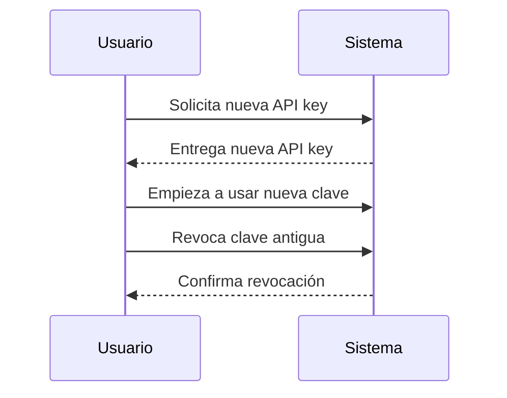

# Auditoría de eventos y rotación de API keys

## Auditoría de eventos

La auditoría de eventos consiste en registrar de forma detallada todas las acciones relevantes que ocurren en el sistema, especialmente aquellas relacionadas con la seguridad o cambios críticos. En el contexto de API keys, esto implica guardar un historial de:

- Quién creó, usó, revocó o intentó usar una API key.
- Cuándo ocurrió cada acción (timestamp).
- Desde qué IP, usuario, app, o contexto se realizó la acción.
- Resultado de la acción (éxito, error, motivo de revocación, etc.).

**¿Para qué sirve?**
- Permite rastrear incidentes de seguridad.
- Facilita el cumplimiento de normativas (compliance).
- Ayuda a depurar problemas y detectar usos indebidos.

**Ejemplo de evento auditado:**
```json
{
  "event": "API_KEY_REVOKED",
  "apiKey": "abc123",
  "revokedBy": "admin@empresa.com",
  "timestamp": "2026-05-28T12:34:56Z",
  "reason": "compromiso detectado",
  "ip": "192.168.1.10"
}
```

---

## Rotación de claves (API key rotation)

La rotación de claves es el proceso de reemplazar periódicamente una API key por una nueva, sin interrumpir el servicio. Es una buena práctica de seguridad porque:

- Reduce el riesgo si una clave se ve comprometida.
- Permite actualizar permisos o cambiar de entorno sin dejar claves antiguas activas.

**¿Cómo funciona?**
1. El sistema permite generar una nueva API key antes de eliminar la anterior.
2. Ambas claves pueden funcionar durante un periodo de transición.
3. Se revoca la clave antigua cuando la nueva ya está en uso.

**Ejemplo de flujo de rotación:**
1. Usuario solicita una nueva API key.
2. El sistema crea la nueva y la asocia al usuario/app.
3. El usuario actualiza sus sistemas para usar la nueva clave.
4. El usuario o el sistema revoca la clave anterior.



---

## Consideraciones para apps con múltiples API keys

Si una aplicación puede tener múltiples API keys (por ejemplo, para distintos desarrolladores o propósitos), la rotación tradicional pierde sentido, ya que cada desarrollador puede gestionar su propia clave de forma independiente. En este caso:

- Es válido permitir varias API keys activas por app.
- La revocación y auditoría siguen siendo fundamentales para seguridad y trazabilidad.
- La "rotación" se convierte en un proceso de revocación y creación de nuevas claves según necesidad, no necesariamente en un ciclo periódico.

---

**Recomendación:**
- Implementar auditoría de eventos es esencial para seguridad y cumplimiento.
- Permitir múltiples API keys por app es una práctica moderna y flexible.
- La rotación tradicional es menos relevante, pero la revocación y la gestión granular de claves son clave.

---

_Actualizado: 2026-05-28_
