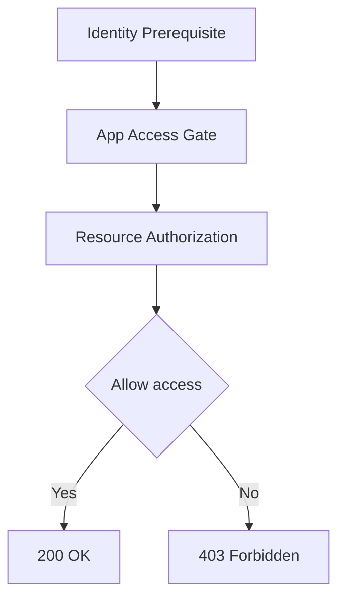

# 04 - Decision Matrix (Resumen rapido)
Ultima actualizacion: 2026-06-23

## Regla en una linea

Entrar != operar

- Entrar a app = App Access Gate
- Operar recursos = Resource Authorization

## Matriz

| Caso | Identity Prerequisite (AuthN) | App Access Gate | Resource Authorization |
|---|---|---|---|
| Login user con appId | Si | Si (user_apps) | No en login |
| Login app por api key | Si | Implicito por api key valida | No en login |
| GET/POST protegido con token user | Ya validado | Ya validado en emision/login | Si (scopes efectivos) |
| GET/POST protegido con token app | Ya validado | Ya validado en emision/token | Si (scopes app token) |

## Flujo visual

Si no renderiza en tu visor actual, revisa que el preview Markdown soporte Mermaid. El contenido del flujo es el mismo que el documento resumen [AUTHZ_MODEL_V2.md](AUTHZ_MODEL_V2.md).
