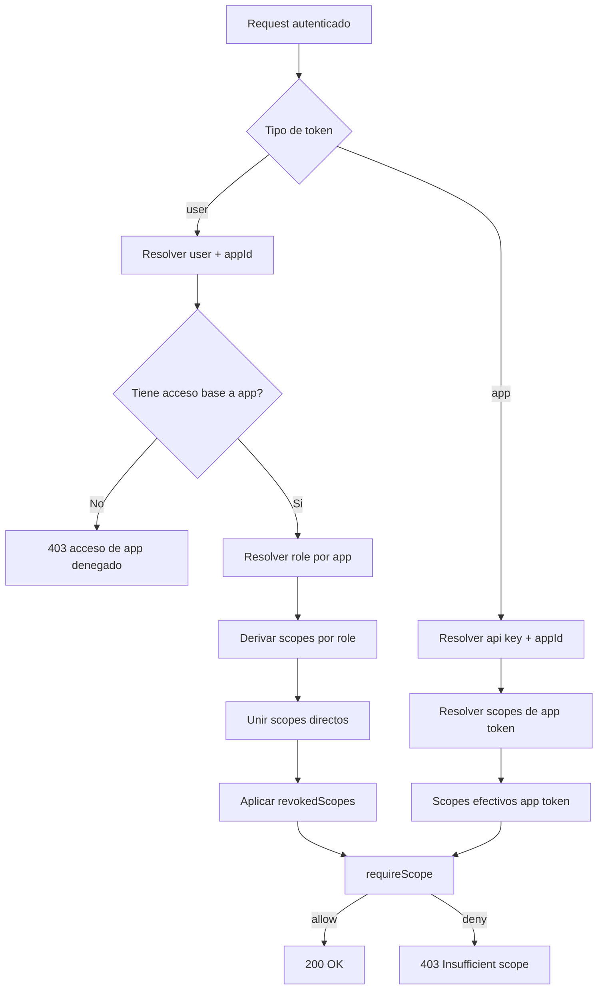

# Modelo de Autorizacion V2 (App Access + Scope Access)
Ultima actualizacion: 2026-06-23
Estado: active
Ambito: actual

## Lectura gradual

Para version modular/desmenuzada, ver:
- [authz/00_README.md](../authz/00_README.md)

## Objetivo
Definir un modelo de autorizacion claro y robusto para el backend actual, separando de forma explicita:

1. Acceso de ingreso a una app (quien puede entrar)
2. Acceso granular a recursos (que puede hacer dentro)

Este modelo mantiene terminologia existente (`role`, `scopes`, `user_apps`, `api keys`) y agrega solo conceptos minimos para mejorar entendimiento.

---

## Principio central

La autorizacion se decide en dos capas:

- Capa A: Acceso a app
  - Respuesta: "puede entrar a esta app?"
  - Fuente principal: `user_apps` (para usuarios) y `api_keys` (para apps)

- Capa B: Acceso a recurso
  - Respuesta: "que accion puede ejecutar dentro de la app?"
  - Fuente principal: scopes efectivos (`role` derivado + scopes directos - revokedScopes)

---

## Vocabulario del modelo

- Identidad: sujeto autenticado (usuario o app)
- Contexto de app: `appId` contra el que se evalua acceso
- Acceso base: permiso de ingreso a una app
- Rol global de usuario: perfil transversal no atado a una app especifica
- Perfil de app: `role` del usuario en una app (`user`, `editor`, `admin`)
- Permiso granular: scope formato `<appId>:<action>:<resource>`
- Permiso efectivo: resultado final aplicado por middleware de scopes

---

## Fuentes de verdad actuales

### Usuario

- Tabla `users`:
  - `role` (rol global de usuario; hoy se usa de forma limitada, especialmente para admin)
  - `scopes` (permisos directos)
  - `revokedScopes` (denegaciones explicitas)

- Tabla `user_apps`:
  - `user_id`
  - `app_id`
  - `role` (perfil del usuario dentro de la app)

### Aplicacion (maquina a maquina)

- Tabla/flujo de `api_keys`:
  - api key asociada a app
  - scopes de api key (cuando aplica)

---

## Roles predefinidos actuales

Definidos en `ROLE_SCOPES`:

- `admin` -> `[*]`
- `user` -> `[read:users, read:catalogs]`
- `editor` -> `[read:users, write:catalogs]`

El `role` no solo concede entrada: define el baseline de permisos granulares dentro de la app.

## Dos niveles de role (recomendado)

Para mantener el modelo entendible sin volverlo caotico, conviene separar asi:

1. `users.role` -> rol global de usuario
  - sirve para privilegios transversales
  - ejemplo claro: `admin` global con acceso universal

2. `user_apps.role` -> rol del usuario dentro de una app
  - sirve para permisos base especificos por app
  - ejemplo: `editor` en app A, `user` en app B

Esto no obliga a tener dos catalogos distintos de roles.
La mejor unificacion es usar el mismo catalogo (`ROLE_SCOPES`) pero aplicarlo en dos contextos distintos:

- Rol global -> scopes con alcance global (`*` o cross-app)
- Rol por app -> scopes prefijados con el `appId` especifico

En otras palabras: mismo diccionario de roles, distinta expansion de alcance.

---

## Como se calcula permiso efectivo (usuario)

1. Validar credenciales (`/api/auth/login`)
2. Validar acceso base en `user_apps` para `appId` solicitado (salvo admin global)
3. Resolver rol global del usuario (`users.role`)
4. Resolver `role` de esa app (`user_apps.role`)
5. Derivar scopes globales si aplica
6. Derivar scopes por role de app y prefijar con `appId`
7. Unir scopes directos del usuario (`users.scopes`)
8. Restar `revokedScopes`
7. Firmar JWT con `appId`, `role`, `scopes` efectivos
8. En endpoints protegidos, `requireScope` evalua patrones y wildcards

Nota de estado actual:
- hoy el sistema ya usa bien el role por app
- el `users.role` global existe y ya soporta el caso `admin`
- si se quiere robustecer mas, el siguiente paso seria derivar formalmente scopes globales desde `users.role` tambien, no solo tratarlo como shortcut de admin

---

## Diagrama de flujo

---

## Diferencia clave: acceso de app vs acceso de recurso

- Acceso de app (`user_apps`)
  - Sin esta relacion, el login con `appId` falla aunque el usuario tenga muchos scopes directos.

- Acceso de recurso (`scopes`)
  - Aun con acceso de app, sin scopes efectivos suficientes se bloquea endpoint protegido.

En otras palabras:
- Entrar != operar

---

## Respuesta a la duda principal (role "sobra" o no)

No sobra. Cumple dos funciones importantes:

1. Define baseline minimo de permisos por app
2. Evita usuarios "sin perfil" al entrar a una app

Mejora aplicada en endpoints:
- En `POST /api/users/:userId/apps`, `role` es opcional
- Si no se envia, se asigna `user` por defecto

Esto permite:
- "Solo quiero habilitar acceso" -> enviar solo `appId`
- "Quiero acceso + perfil especifico" -> enviar `appId` + `role`

## Respuesta a la duda nueva: role global + role por app genera caos?

No, si cada uno responde a una pregunta distinta:

- `users.role` responde: "tiene privilegios transversales en todo el sistema?"
- `user_apps.role` responde: "que perfil tiene dentro de esta app especifica?"

Ejemplo sano:
- usuario normal: `users.role = user`
- en app A: `user_apps.role = editor`
- en app B: `user_apps.role = user`

Ejemplo superusuario:
- `users.role = admin`
- scopes globales efectivos: `*`
- puede entrar a cualquier app y a cualquier recurso

La clave para que no se vuelva confuso es documentar precedencia:

1. global role
2. app role
3. direct scopes
4. revoked scopes

---

## Endpoints operativos del modelo

### Acceso base a app (usuario)

- `POST /api/users/:userId/apps`
  - crea/actualiza acceso en `user_apps`
  - body: `{ appId, role? }` (`role` default: `user`)

- `DELETE /api/users/:userId/apps/:appId`
  - remueve acceso en `user_apps`

### Permisos granulares (usuario)

- `GET /api/users/:userId/scopes`
- `POST /api/users/:userId/scopes`
- `DELETE /api/users/:userId/scopes`
- `POST /api/users/:userId/revoked-scopes`
- `DELETE /api/users/:userId/revoked-scopes`

---

## Robustez y buenas practicas

Este diseño es robusto y flexible porque:

- Separa decision de ingreso de decision de permisos
- Permite multiples apps por usuario con role independiente por app
- Permite excepciones granulares sin romper el baseline de role
- Soporta wildcards para administracion global
- Mantiene compatibilidad con tokens de usuario y tokens de app

Puntos a fortalecer despues (opcional):

1. Unificar middleware de `verifyUserToken` para requerir siempre `type=user` en rutas de usuario
2. Exponer `rolesPorApp` en endpoint dedicado para observabilidad
3. Añadir auditoria formal para alta/baja de `user_apps`
4. Definir versionado de esquema de permisos para evolucion controlada

---

## Matriz rapida

| Caso | Requiere user_apps | Requiere scopes efectivos |
|---|---|---|
| Login usuario con appId | Si | No (en login) |
| GET protegido por requireScope | Ya validado por token | Si |
| Token de app (api key) | No user_apps | Si (scopes app token) |

---

## Referencias

- [authz/00_README.md](../authz/00_README.md)
- [authentication-design.md](../auth/authentication-design.md)
- [SCOPE_CONVENTION.md](../authz/SCOPE_CONVENTION.md)
- [USERS_TEST_README.md](../testing/USERS_TEST_README.md)
- [ENDPOINTS_GUIDE.md](../testing/ENDPOINTS_GUIDE.md)
