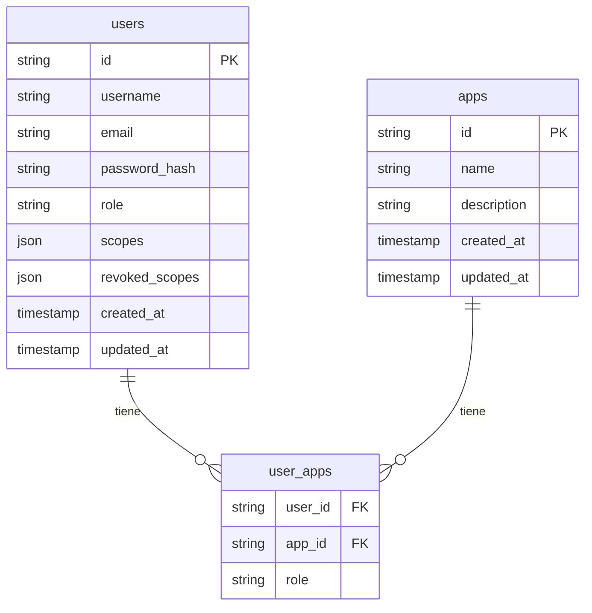

# Relación entre usuarios, apps y roles en el backend

## Diagrama entidad-relación (ER)



## ¿Dónde se registran los scopes?
- Los **scopes** (permisos granulares) se almacenan en el campo `scopes` de la tabla `users` como un array JSON.
- Los **scopes derivados** de roles se definen en el backend, por ejemplo:

```typescript
export const ROLE_SCOPES: Record<string, string[]> = {
    'admin': ['*'],
    'user': ['read:users', 'read:catalogs'],
    'editor': ['read:users', 'write:catalogs'],
};
```
- Cuando un usuario tiene un rol en una app (en `user_apps`), el backend calcula sus scopes efectivos combinando:
  - Scopes derivados del rol (`ROLE_SCOPES`)
  - Scopes directos (`users.scopes`)
  - Scopes revocados (`users.revoked_scopes`)

## Ejemplo de scopes en la base de datos
```json
["app1:read:users", "app1:write:catalogs"]
```

## Resumen
- La relación usuario-app-rol se modela con la tabla `user_apps`.
- Los scopes se derivan de los roles definidos en el backend y se pueden extender con scopes directos en la tabla `users`.
- Los scopes no se almacenan en una tabla separada, sino como JSON en el usuario y se calculan dinámicamente.

## Queries útiles en DBeaver

### 1) Ver scopes directos y revocados de un usuario
```sql
SELECT
    id,
    username,
    role,
    scopes,
    revoked_scopes
FROM users
WHERE username = 'jorge';
```

### 2) Ver roles por app del usuario
```sql
SELECT
    ua.user_id,
    u.username,
    ua.app_id,
    a.name AS app_name,
    ua.role
FROM user_apps ua
JOIN users u ON u.id = ua.user_id
JOIN apps a ON a.id = ua.app_id
WHERE u.username = 'jorge';
```

### 3) Verificación rápida de acceso por app
```sql
SELECT
    u.username,
    ua.app_id,
    ua.role,
    u.scopes,
    u.revoked_scopes
FROM users u
LEFT JOIN user_apps ua ON ua.user_id = u.id
WHERE u.username = 'jorge';
```
